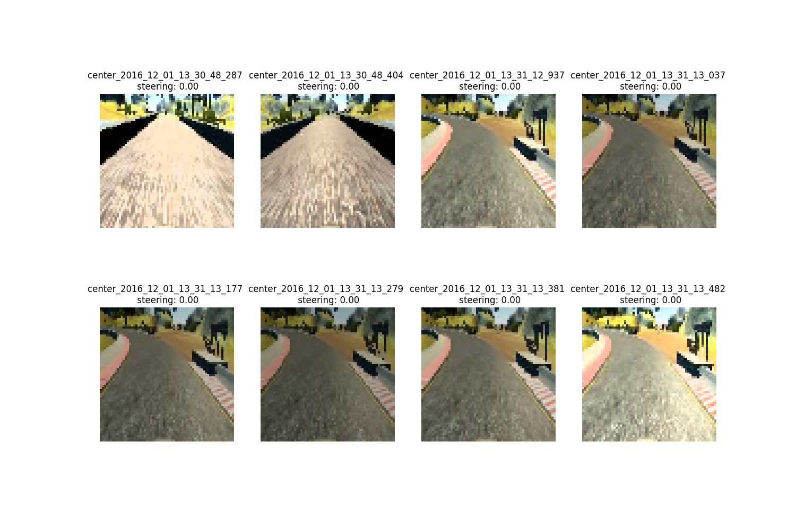

# **Behavioral Cloning** 

---

**Behavioral Cloning Project**

The goals / steps of this project are the following:
* Use the simulator to collect data of good driving behavior
* Build, a convolution neural network in Keras that predicts steering angles from images
* Train and validate the model with a training and validation set
* Test that the model successfully drives around track one without leaving the road
* Summarize the results with a written report


---
### Files Submitted & Code Quality

#### 1. Submission includes all required files and can be used to run the simulator in autonomous mode

My project includes the following files:
* model.py containing the script to create and train the model, which includes image normalizaiton, data augmentation and train and validation generator.
* drive.py for driving the car in autonomous mode
* model.h5 containing a trained convolution neural network 
* README.md summarizes the results

#### 2. Submission includes functional code
Using the Udacity provided simulator and my drive.py file, the car can be driven autonomously around the track by executing 
```sh
python drive.py model.h5
```

The model.py file contains the code for training and saving the convolution neural network. The file shows the pipeline I used for training and validating the model, and it mainly contains image normalizaiton, data augmentation, train and validation generator and the design of network. 

In order to exploit the left and right images, I make adjusted steering angles for those images, for left image `steering_left = steering_center + 0.2` and for right, `steering_right = steering_center - 0.2`. 

For the data augmentation, I mainly utilize **brightness augmentation** and **horizontal flip**. 

Since the half up image contains noisy information such as trees and sky, I crop the whole image by `img = img[50:-20,...]`. 

Comparing to natural images, the information in the simulated dataset is not so rich. Considering that, I can resize the cropped image into the size of `64x64`, so that the useful information for the steering angle prediction cannot lose too much.  

The image normalization I just transfer the range of image pixel into `(0,1)` by `x = Lambda((lambda x: x/255.0))(inputs)`.

Here is the example that the input for training the nework:


*image preprocessing examples*

By utilizing left and right images for the augmentation, here is the distribution in terms of steering angle:


*Steering angle distribution before and after data agumentation*


### Model Architecture and Training Strategy

#### 1. An appropriate model architecture has been employed

At first, I would like to large network to train, but the performance is not good. I think the reasons can be there are not enough dataset to feed into large network and the contextual and semantic information of the cropped images is not so complex and rich. Then, I make use of tiny network. Below is the architecture of my network:

| Layer         		|     Output Shape	        					| 
|:---------------------:|:---------------------------------------------:| 
| input_1 (InputLayer)  | (None, 64, 64, 3) 	| 
| lambda_1 (Lambda)   	| (None, 64, 64, 3) 	|
| conv2d_1 (Conv2D)     | (None, 64, 64, 3)     |
| conv2d_2 (Conv2D)		| (None, 62, 62, 16)	|
| max_pooling2d_1		| (None, 31, 31, 16)    |
| conv2d_3 (Conv2D)    	| (None, 29, 29, 32) 	|
| max_pooling2d_2      	| (None, 14, 14, 32)    |
| conv2d_4 (Conv2D) 	| (None, 12, 12, 64) 	|
| max_pooling2d_3		| (None, 6, 6, 64)		|
| conv2d_5 (Conv2D)    	| (None, 6, 6, 64) 		|
| max_pooling2d_4      	| (None, 3, 3, 64)      |
| flatten_1 (Flatten)	| (None, 576)           |
| dropout_1 (Dropout)   | (None, 576)           |
| dense_1 (Dense)		| (None, 128)			|
| dropout_2 (Dropout)   | (None, 128)           |
| dense_2 (Dense)   	| (None, 32)            |
| dropout_3 (Dropout)   | (None, 32)            |
| dense_3 (Dense)		| (None, 1)    			|
| | |


The model includes RELU layers to introduce nonlinearity.


#### 2. Attempts to reduce overfitting in the model

The model contains dropout layers in order to reduce overfitting. 

The model was trained and validated on different data sets to ensure that the model was not overfitting. All the samples are split by 8:2 as for train and validation dataset. Also, weight decay is also introduced in training. 
Here are the recorded train and validation loss during training. Overfitting is not observed. 


#### 3. Model hyperparameter for training 

The optimizer I used for training is adam and other hyperparameters are

* Batch size: 256
* Learning rate: 0.001
* Weight decay rate: 1e-4
* Epoch: 20


#### 4. Testing phase

Here is the output of testing phase:


It can be seen that the trained model can successfully predict the steering angles. 

### Discussion

I also tried to train a model for the track 2. I drove about 4 rounds to train the network. Although the network can convergence during training and no overfitting observed from validation dataset, it failed in test phase at a shape turn. I guess one reason may be there are not enough samples, especially in complicated cases. Also, how to set right adjusted angles for left and right images is another issue to be considered. 
